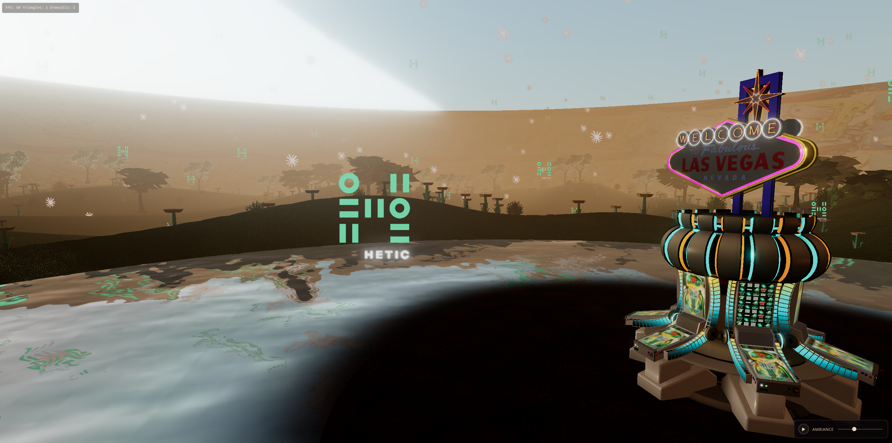

# L'île de Three JS

**Une île remplie de Paris, de flocons de Claude et quelques logo Hetic.**



Scène 3D de nature : terrain procédural circulaire, forêt LOD + impostors, lac rond central avec île et pod Las Vegas, bloom cinématographique, particules Claude + Hetic qui tombent, ambiance sunset.

---

## Lancement local

Serveur HTTP statique, zéro install :

```bash
python -m http.server 8080
```

Puis `http://localhost:8080/`.

Alternative :

```bash
npx serve
```

## Stack

- Three.js r161 via import map (CDN unpkg)
- Addons : Sky, Water, EffectComposer, UnrealBloom, OrbitControls, GLTFLoader, DRACOLoader, MeshSurfaceSampler
- Zéro dépendance npm, aucun build

## Contrôles

- **Souris** : rotation (clic gauche), pan (clic droit), zoom (molette)
- **Flèches / WASD** : déplacement caméra
- **Lecteur musique** : bottom-right
